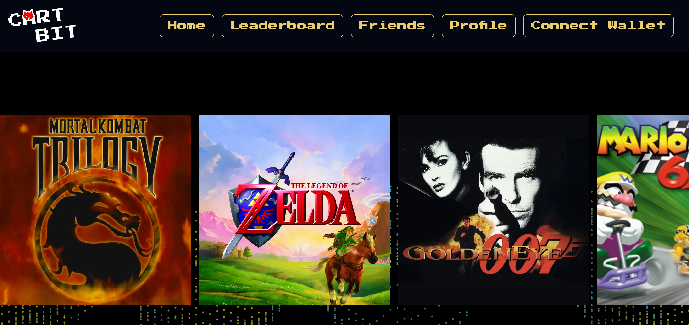

# CARTBIT 🕹️

An Arcade System running on Cartesi.

## Features 🎲

- Play Nintendo 64 Games
- **Keep your game on chain:** Store Game States onchain and return to them anytime in the future - permament storage.
- **Leaderboard:** Earn rewards for playing the old retro game you love. Show your friends how much you game to old rocking top quality video games
- **Challenge your friends:** Battle against your friends, pool in some tokens to bet for who can win a match
- **Open Community:** Open Source Code - We use Open Software to emulate the games under the hood - Retro arch compiled in WebAssembly

## Stack 🎯

- NextJS
- Sunodo
- Typescript / RainbowKit
- TailwindCSS
- Emscripten

## Demo

## Links

- [Play now](https://cartbit.vercel.app)
- [Github](https://github.com/dolvin17/cartgames)
